# Manual de Usuario: Stories

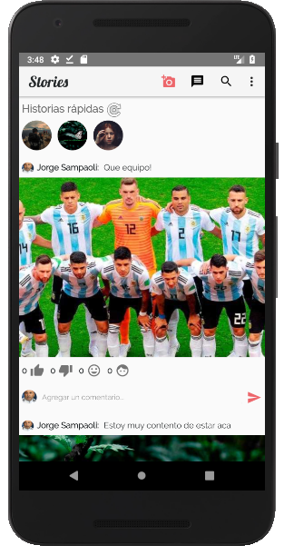

La aplicación tiene diferentes funcionalidades que se engloban en las siguientes actividades:

* Registro en la aplicación
* Interactuar con Historias
* Agregar amigos
* Chatear con amigos

## Registro en la aplicación

Al iniciar la aplicación, el usuario será dirigido a la pantalla de Login.

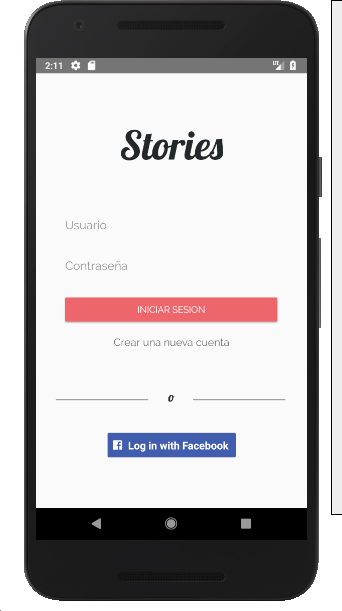

En esta pantalla, se pueden optar por 3 caminos posibles:

1. Iniciar sesión con un usuario ya configurado.
1. Iniciar sesión con un usuario de Facebook.
1. Crear una nueva cuenta.

Si el usuario decide crear una nueva cuenta, debe completar la siguiente información:

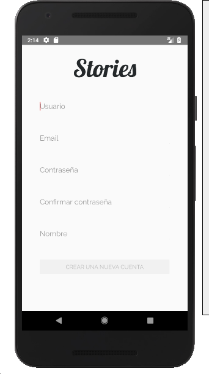 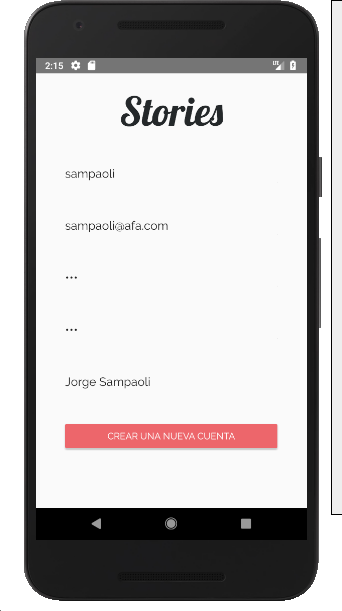

Luego de registrarse, o de iniciar sesión via Log In, se procede a la pantalla principal, _Home_, donde se visualizan las historias. El usuario podrá visualizar su perfil y realizar cambios sobre éste al seleccionar la opción _Perfil_ del Menú extendido (tres puntitos en la parte superior de la pantalla).

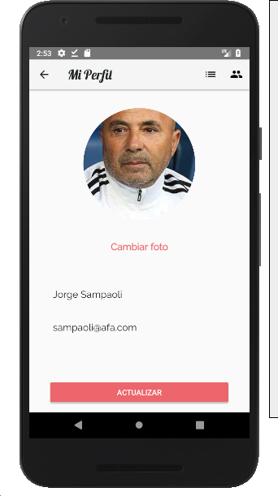

## Interactuar con Historias

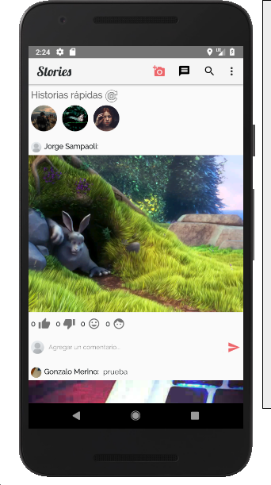

La pantalla principal muestra las historias que el usuario activo puede visualizar, dado que son públicas o de sus amigos. Además, podrá visualizar las historias rápidas que han sido creadas en las últimas 4 horas.

El usuario el usuario podrá realizar las siguientes acciones sobre las historias:

* *(Sólo para las historias no creadas por el usuario)* Reaccionar a una historia: con un _me gusta_, _no me gusta_, _me divierte_, _me aburre_.
* Agregar un comentario en la historia.

    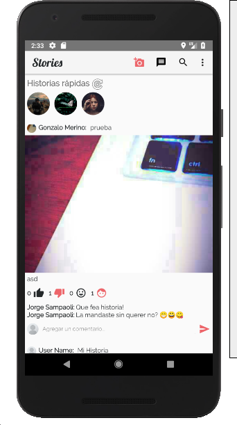

En el menú de la parte superior, se pueden observar 4 íconos, con las siguientes funcionalidades (de izquierda a derecha)

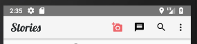

* Crear nuevas historias
* Ver mensajes directos
* Buscar usuarios
* Menú extendido (tres puntitos)

Finalmente, se podrán visualizar las historias en un _Mapa de actividades_ al seleccionar la opción del menu superior:

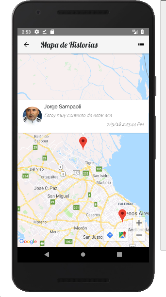

### Crear nuevas historias

Para crear nuevas historias, se deben seguir los siguientes pasos:

Se puede seleccionar un _título_, una _descripción_, si es _rápida_ o no y su visibilidad: _pública_ (para todos) o _privada_ (sólo amigos).

Si se selecciona la opción _historia rápida_, la diferencia es que la historia se verá en la parte superior como un círculo, y durará unas 4 horas.

## Agregar amigos

Para agregar amigos, primero debe seleccionarse la opción de _Buscar usuarios_ en el menú de la parte superior (lupa). A continuación, debe buscarse el usuario a agregar y luego seleccionarse el botón de _Agregar amigo_ (el tercero).

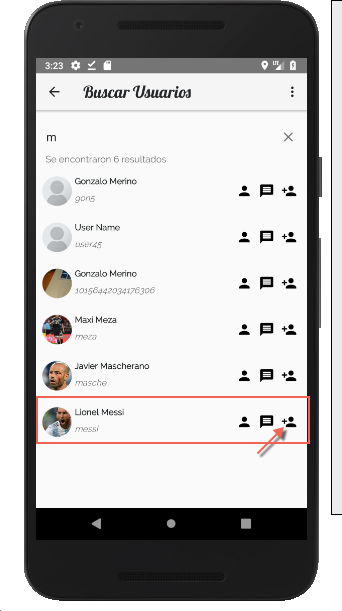

Al clickear el botón, se notificará que se ha enviado una solicitud de amistad al usuario seleccionado. Tanto las solicitudes enviadas como recibidas pueden visualizarse al clickear la respectiva opción en el menú correspondiente.

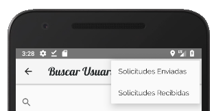

Por ejemplo, para solicitudes enviadas:

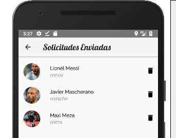

Nótese tambien que en esta pantalla se puede también:

* Ver el perfil del usuario
* Enviar un mensaje directo

## Chatear con amigos

Para chatear con amigos, se pueden realizar las siguientes acciones:

1. Entrar a la pantalla de Chat, clickeando la opción _Ver mensajes directos_ en el menú superior.
1. Buscar a un usuario, clickeando en la opción _Buscar usuarios_ en el menú superior y luego en el ícono para _enviar un mensaje directo_.

En la pantalla de Chat, se pueden ver todas las conversaciones del usuario:

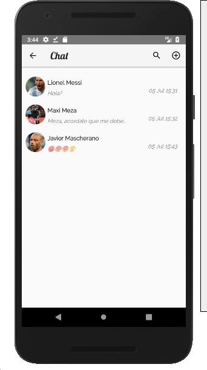

Al seleccionar una de ellas, puede verse la conversación entre usuarios:

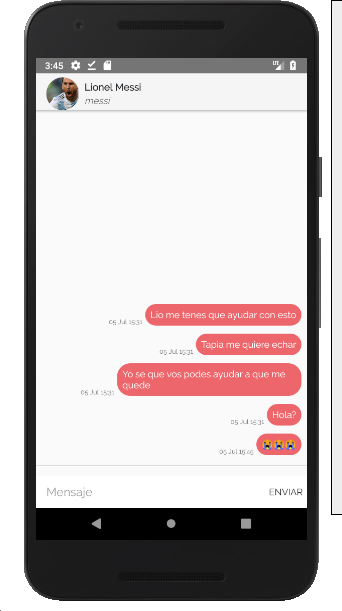 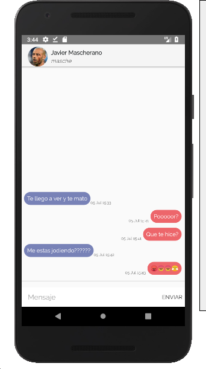
